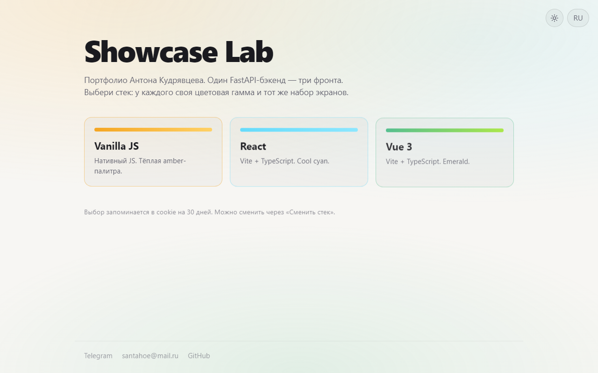
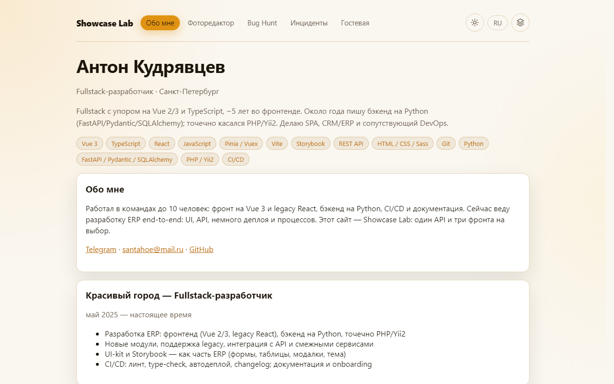

# Showcase Lab

Портфолио fullstack-разработчика: один FastAPI API и три одинаковых по экранам фронта.

🌐 **Сайт:** [anton-kudryavcev.ru](https://anton-kudryavcev.ru) · **API docs:** [/docs](https://anton-kudryavcev.ru/docs) · **License:** [MIT](LICENSE)

| Стек | Палитра | URL |
|------|---------|-----|
| Vanilla JS | amber | `/app/vanilla/` |
| React | cyan | `/app/react/` |
| Vue 3 | emerald | `/app/vue/` |

Экраны: About (с кейсами), Photo Editor, Bug Hunt, Incident Board, Guestbook. Тема и локаль (`ru` / `en`) общие; на `/` выбирается стек (cookie `fw`).





## Design decisions

- **Три фронта на одном API** — показать паритет Vanilla / React / Vue и работу fullstack-стека, а не три разных продукта.
- **Photo editor** — пакет `@showcase-lab/photo-editor` на Vue + Konva. React подключает его через `mountPhotoEditor()` и поэтому тянет `vue` / `@vitejs/plugin-vue` только как runtime-хост редактора.
- **CORS** — allowlist прод-origin и localhost (Vite/dev), не `*`. Переопределение: env `CORS_ORIGINS`.
- **Security headers** — `X-Content-Type-Options`, `Referrer-Policy`, `X-Frame-Options` на всех ответах.
- **Деплой** — Docker multi-stage; на push в `main` CI гоняет проверки и SSH-деплой (`scripts/deploy.sh`).

## Запуск

Нужны Node.js 20+ (в Docker — 22) и [uv](https://docs.astral.sh/uv/).

```powershell
.\scripts\dev.ps1          # sync + build frontends + uvicorn
.\scripts\dev.ps1 -SkipBuild
```

```bash
./scripts/dev.sh
docker build -t showcase-lab .
docker run --rm -p 8000:8000 showcase-lab
```

Проверки: `uv run ruff check . && uv run pytest`; во фронтах — `npm run lint` / `npm run typecheck` / `npm run build`. CI также собирает `packages/photo-editor` (`build:lib`).
